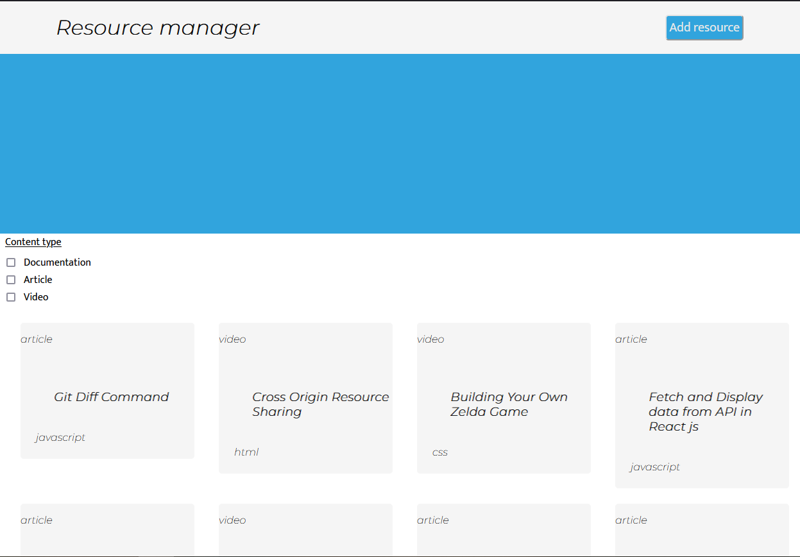

# Code Bandits - Bootcampers Resource Library



A resource library for bootcampers, where they can upload useful links and search by media preference.

## Features

- Filter resources by media type
- Upload resources
- Responsive resource display

## Technologies


## File Structure

```
code-bandits
│   README.md
│
│
└─── public
|        |
|        └─ favicon.ico
|        └─ index.html
|        └─ logo192.png
|        └─ logo512.png 
|        └─ manifest.json
|        └─ robots.txt
|        └─ w9_project_screenshot_2.png
|
|
└─── src
       │  
       │  
       │
       └─── Components
       |           │
       |           └─── App
       |           │       | 
       |           |       └─ App.js
       |           |       └─ App.test.js
       |           |
       |           |
       |           └─── DisplayContainer
       |           |       |
       |           |       └─ DisplayContainer.js
       |           |       └─ DisplayContainer.test.js
       |           |
       |           |
       |           └─── FilterSection
       |           |       |
       |           |       └─ FilterSection.js
       |           |       └─ FilterSection.test.js
       |           |
       |           |
       |           └─── Header
       |           |       |
       |           |       └─ Header.js
       |           |       └─ Header.test.js
       |           |
       |           |
       |           └─── ResourceCard 
       |           |       |
       |           |       └─ ResourceCard.js
       |           |       └─ ResourceCard.test.js
       |           |
       |           |
       |           └─── UploadForm
       |                   |
       |                   └─ UploadForm.js
       |                   └─ UploadForm.test.js
       |                   └─ UploadFormPopUp.js
       |                   └─ UploadFormPopUp.test.js
       |
       |
       |
       └─── Libs
       |       |
       |       └─ data.js
       |       └─ index.js
       |
       |
       |
       └─── services
       |       |
       |       └─ fetchFromAPI.js
       |
       |
       |
       └─ index.css
       └─ index.js
       └─ logo.svg
       └─ reportWebVitals.js
       └─ setupTests.js
```

## Available Scripts

In the project directory, you can run:

### `npm start`

Runs the app in the development mode.\
Open [http://localhost:3000](http://localhost:3000) to view it in your browser.

The page will reload when you make changes.\

### `npm test`

Launches the test runner in the interactive watch mode.\

## Run Locally

Clone the project (frontend and backend)

```bash
  git clone https://github.com/SchoolOfCode/w9_frontend-project-the-code-bandits
```

```bash
  git clone https://github.com/SchoolOfCode/w9_backend-project-the-code-bandits
```

Go to the project directory

```bash
  cd code-bandits
```

Install dependencies

```bash
  npm install
```

Start the server

```bash
  npm run start
```

## Running Tests

To run tests, run the following command

```bash
  npm run test
```

## Roadmap

- A bookmark/favourites facility
- An estimate of time taken to use each resource

## Authors

- [@PiraTejasakulsin](https://www.github.com/piratejas)
- [@MordecaiOladimeji](https://www.github.com/MordecaiO)
- [@LorentzBloom](https://www.github.com/Lauro235)
- [@SimonBowen](https://www.github.com/sibowen535)

## Feedback

If you have any feedback, please reach out to us at talkto@theduck.co.uk

## Appendix

-  [React docs link](https://beta.reactjs.org/)

-  [Jest docs link](https://jestjs.io/docs/getting-started)

-  [Bootstrap docs link](https://getbootstrap.com/docs/4.1/getting-started/introduction/)

-  [Express docs link](https://devdocs.io/express/)

-  [Postgres docs link](https://www.postgresql.org/docs/)

